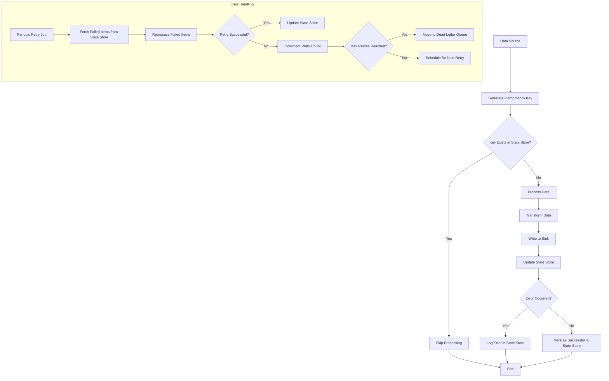
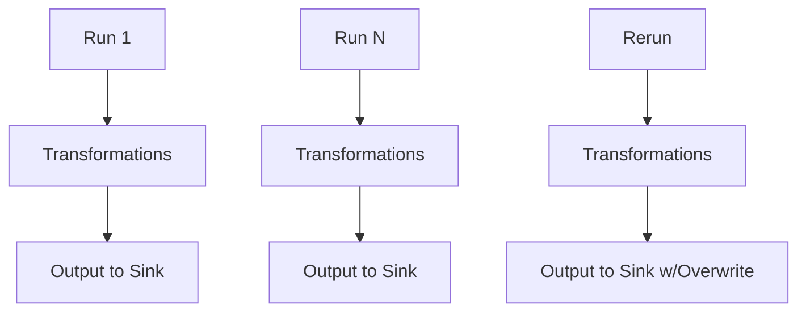

# Idempotent Pipelines

## Description
Running the pipeline multiple times with the same input yields the same output, which is useful for easy reruns and clear data lineage.

## Constraints/Challenges
- Longer development time.
- Hard to maintain with changing requirements.
- Ensuring all components of the pipeline are idempotent.
- Handling side effects in external systems.
# Idempotent Pipelines

## Description
Idempotent pipelines are designed to produce the same output regardless of how many times they are executed with the same input. This property is crucial for ensuring data consistency, simplifying error recovery, and maintaining clear data lineage. Idempotency allows for easy reruns of the pipeline without fear of data duplication or inconsistency.

## Constraints/Challenges
- Increased development time due to the need for careful design and implementation.
- Difficulty in maintaining idempotency with changing business requirements.
- Ensuring all components of the pipeline, including external systems and APIs, support idempotent operations.
- Handling side effects in external systems that may not be naturally idempotent.
- Managing state and checkpoints to support idempotency across pipeline stages.
- Dealing with time-sensitive data or operations that may affect idempotency.

## Implementation Strategies
1. **Unique Identifiers**: Assign unique IDs to each data record or batch to detect and handle duplicates.
2. **Checkpointing**: Implement a robust checkpointing mechanism to track progress and resume from the last successful point.
3. **Deduplication**: Use a combination of unique identifiers and timestamps to identify and remove duplicate data.
4. **Upsert Operations**: Instead of simple inserts, use upsert (insert or update) operations in the data sink.
5. **Idempotent Transformations**: Ensure all data transformations are idempotent by design.
6. **State Management**: Maintain a state store to track processed items and their outcomes.
7. **Transactional Updates**: Use distributed transactions for complex, multi-step operations to ensure atomicity.

## Example Implementation (Python)
```python
import hashlib
from datetime import datetime

class IdempotentPipeline:
    def __init__(self, state_store):
        self.state_store = state_store

    def generate_idempotency_key(self, data):
        return hashlib.md5(str(data).encode()).hexdigest()

    def process_data(self, data):
        idempotency_key = self.generate_idempotency_key(data)
        
        if self.state_store.exists(idempotency_key):
            print(f"Skipping already processed data: {idempotency_key}")
            return
        
        try:
            # Perform transformations
            transformed_data = self.transform(data)
            
            # Write to sink
            self.write_to_sink(transformed_data)
            
            # Update state store
            self.state_store.set(idempotency_key, {
                'processed_at': datetime.utcnow().isoformat(),
                'status': 'success'
            })
        except Exception as e:
            print(f"Error processing data: {e}")
            self.state_store.set(idempotency_key, {
                'processed_at': datetime.utcnow().isoformat(),
                'status': 'error',
                'error_message': str(e)
            })

    def transform(self, data):
        # Implement idempotent transformations
        return data

    def write_to_sink(self, data):
        # Implement idempotent write operation (e.g., upsert)
        pass

# Usage
state_store = InMemoryStateStore()  # Or any persistent state store
pipeline = IdempotentPipeline(state_store)

data_batch = [{'id': 1, 'value': 'a'}, {'id': 2, 'value': 'b'}]
for item in data_batch:
    pipeline.process_data(item)
```

## Mermaid Diagram


## Notes and References
- Idempotent pipelines significantly simplify debugging, error recovery, and data consistency management.
- Use a combination of unique identifiers, timestamps, and checksums to ensure idempotency across all pipeline stages.
- Implement comprehensive error handling and logging for easier troubleshooting and auditing.
- Consider using a distributed transaction system for complex pipelines with multiple interdependent stages.
- Regularly test the idempotency of your pipeline by intentionally triggering reruns and validating the output.

### Additional References:
- [Idempotency Patterns](https://blog.jonathanoliver.com/idempotency-patterns/) by Jonathan Oliver
- [Designing Data-Intensive Applications](https://dataintensive.net/) by Martin Kleppmann (Chapter 9: Consistency and Consensus)
- [Building Idempotent Pipelines in Apache Beam](https://beam.apache.org/documentation/patterns/idempotence/)
- [Exactly-Once Semantics in Apache Kafka](https://www.confluent.io/blog/exactly-once-semantics-are-possible-heres-how-apache-kafka-does-it/)
- [Implementing Idempotency in Distributed Systems](https://www.baeldung.com/cs/idempotency-in-distributed-systems)
## Mermaid Diagram


## Notes and References
- Idempotent pipelines simplify debugging and error recovery.
- Use unique identifiers or timestamps to ensure idempotency.
- Implement proper error handling and logging for easier troubleshooting.
- Consider using a distributed transaction system for complex pipelines.

### Additional References:
- [Idempotency Patterns](https://blog.jonathanoliver.com/idempotency-patterns/) by Jonathan Oliver
- [Designing Data-Intensive Applications](https://dataintensive.net/) by Martin Kleppmann (Chapter 9: Consistency and Consensus)
- [Building Idempotent Pipelines in Apache Beam](https://beam.apache.org/documentation/patterns/idempotence/)
- [Exactly-Once Semantics in Apache Kafka](https://www.confluent.io/blog/exactly-once-semantics-are-possible-heres-how-apache-kafka-does-it/)