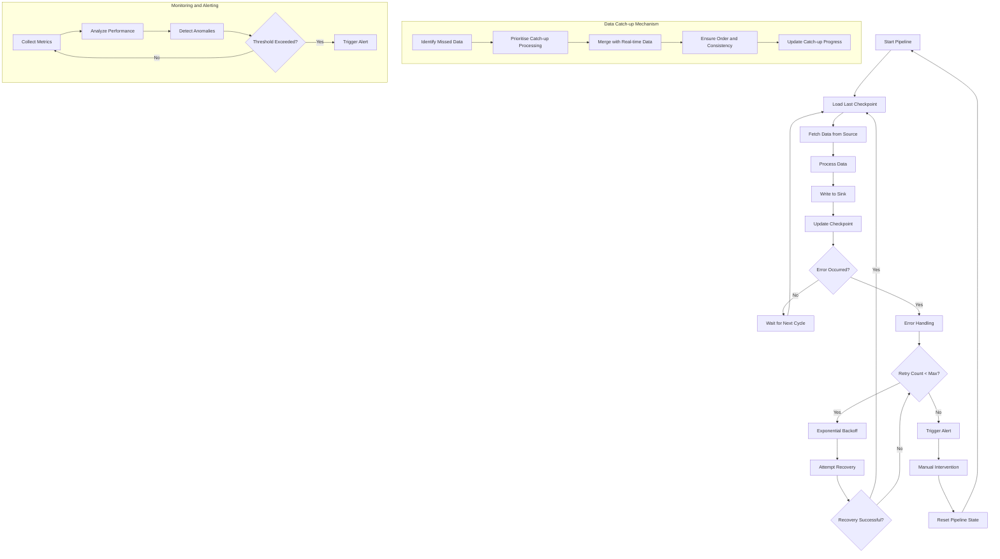

# Self-healing Pipelines

## Description
Self-healing pipelines are designed to automatically recover from failures and process any data that was missed during downtime or errors. These pipelines are resilient to upstream issues, network problems, and temporary service outages. They can "catch up" on unprocessed data, ensuring data completeness and reducing the need for manual intervention.

## Constraints/Challenges
- Code bugs may go unnoticed if the self-healing mechanism masks their symptoms.
- Duplicate data processing needs to be carefully managed to prevent data inconsistencies.
- Increased complexity in pipeline design and implementation.
- Potential for increased resource usage during catch-up periods.
- Difficulty in maintaining correct order of data processing, especially for time-sensitive data.
- Handling long-running catch-up scenarios without impacting real-time data processing.

## Implementation Strategies
1. **Checkpointing**: Regularly save the state of processed data to allow resumption from the last known good state.
2. **Dead Letter Queues**: Store failed messages for later reprocessing or analysis.
3. **Retry Mechanisms**: Implement exponential backoff and jitter for transient failures.
4. **Circuit Breakers**: Prevent cascading failures by temporarily disabling problematic components.
5. **Monitoring and Alerting**: Implement comprehensive monitoring to detect and respond to issues quickly.
6. **Idempotent Operations**: Ensure that reprocessing data doesn't lead to duplicate or inconsistent results.
7. **Data Versioning**: Maintain versions of processed data to handle reprocessing scenarios.

## Example Implementation (Python)
```python
import time
from datetime import datetime, timedelta

class SelfHealingPipeline:
    def __init__(self, source, sink, checkpoint_store):
        self.source = source
        self.sink = sink
        self.checkpoint_store = checkpoint_store
        self.retry_interval = 60  # seconds
        self.max_retries = 5

    def run(self):
        while True:
            try:
                last_processed_timestamp = self.checkpoint_store.get_last_checkpoint()
                current_timestamp = datetime.utcnow()

                # Process data from last checkpoint to current time
                data = self.source.get_data(last_processed_timestamp, current_timestamp)
                processed_data = self.process_data(data)
                self.sink.write(processed_data)

                # Update checkpoint
                self.checkpoint_store.save_checkpoint(current_timestamp)

            except Exception as e:
                print(f"Error occurred: {e}")
                self.handle_error()

            time.sleep(self.retry_interval)

    def process_data(self, data):
        # Implement data processing logic
        return data

    def handle_error(self):
        for attempt in range(self.max_retries):
            try:
                # Attempt to recover
                self.recover()
                return
            except Exception as e:
                print(f"Recovery attempt {attempt + 1} failed: {e}")
                time.sleep(self.retry_interval * (2 ** attempt))  # Exponential backoff

        print("Max retries reached. Manual intervention required.")

    def recover(self):
        # Implement recovery logic (e.g., reset connections, clear caches)
        pass

# Usage
source = DataSource()
sink = DataSink()
checkpoint_store = CheckpointStore()
pipeline = SelfHealingPipeline(source, sink, checkpoint_store)
pipeline.run()
```

## Mermaid Diagram


## Notes and References
- Self-healing pipelines significantly reduce alert fatigue and the need for constant manual intervention.
- Implement comprehensive logging and monitoring to track the pipeline's self-healing actions and overall health.
- Use circuit breakers to prevent overloading recovering systems and to fail fast when upstream services are unavailable.
- Consider implementing a "catch-up" mode that can process historical data at a higher rate when recovering from extended downtime.
- Regularly test failure scenarios to ensure the self-healing mechanisms work as expected.

### Additional References:
- [Building Resilient Data Pipelines](https://www.databricks.com/blog/2020/06/22/building-resilient-data-pipelines.html) by Databricks
- [Designing Resilient Systems: Circuit Breakers or Retries?](https://engineering.grab.com/designing-resilient-systems-part-1) by Grab Engineering
- [Patterns for Resilient Architecture](https://docs.microsoft.com/en-us/azure/architecture/patterns/category/resiliency) by Microsoft
- [Building Self-Healing Infrastructure](https://www.oreilly.com/content/building-self-healing-infrastructure/) by O'Reilly
- [Chaos Engineering: System Resiliency in Practice](https://www.oreilly.com/library/view/chaos-engineering/9781492043850/) by O'Reilly