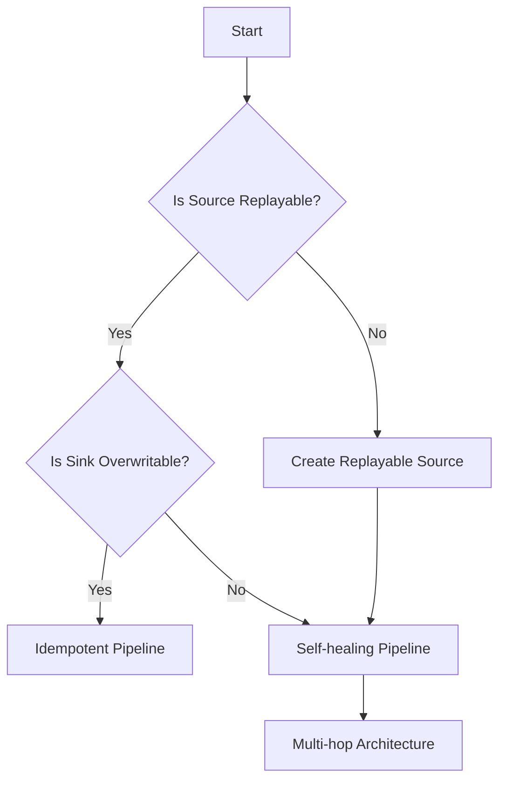

# Decision-Making Blueprint

## Description
A flow chart to help choose the appropriate design pattern for a data pipeline based on various factors.

## Mermaid Diagram

## Notes and References
- Decision-making blueprints guide the design process by providing a structured approach to choosing the most suitable pipeline architecture.
- Consider factors such as data volume, latency requirements, and system complexity when making decisions.
- The blueprint helps in identifying potential bottlenecks and challenges early in the design phase.
- Regularly revisit and update the blueprint as requirements and technologies evolve.

### Additional References:
- [Data Pipeline Architecture Patterns](https://towardsdatascience.com/data-pipeline-architecture-patterns-the-good-the-bad-and-the-ugly-e3b19aafdb9c)
- [Designing Data-Intensive Applications](https://dataintensive.net/) by Martin Kleppmann
- [The Data Engineering Cookbook](https://github.com/andkret/Cookbook) by Andreas Kretz