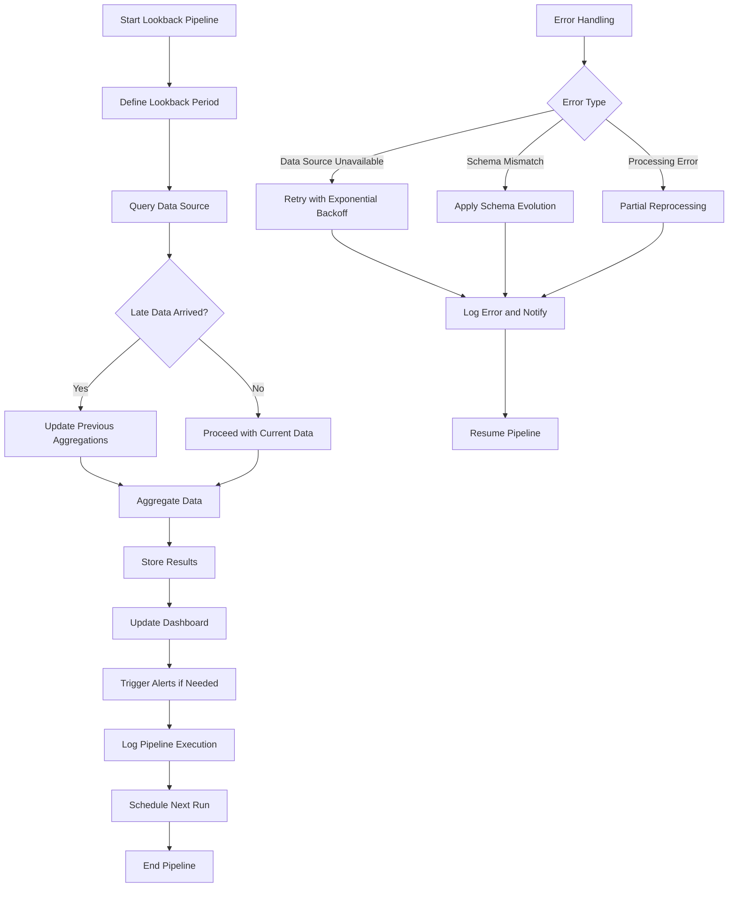

# Lookback Pull

## Description
Lookback Pull is a data extraction pattern that involves pulling aggregate metrics for a past period. This method is particularly well-suited for large data sources where recent data is needed for analysis or reporting. It's easy to implement and provides a balance between data freshness and processing efficiency.

## Constraints/Challenges
- Metrics may change with late-arriving events, potentially causing confusion or inconsistencies.
- Balancing the lookback window sise with processing time and resource usage is crucial.
- Ensuring consistency across multiple lookback pulls, especially when dealing with overlapping time periods.
- Handling data schema changes that may occur during the lookback period.
- Managing the trade-off between data freshness and computational cost.

## Implementation Example
Here's a Python example using Apache Beam for a Lookback Pull pattern:

```python
import apache_beam as beam
from apache_beam.options.pipeline_options import PipelineOptions

class LookbackPull(beam.DoFn):
    def __init__(self, lookback_days):
        self.lookback_days = lookback_days

    def process(self, element):
        # Simulate pulling data for the lookback period
        start_date = element - timedelta(days=self.lookback_days)
        end_date = element
        
        # In a real scenario, you would query your data source here
        data = query_data_source(start_date, end_date)
        
        yield data

def run_lookback_pipeline(pipeline_args=None):
    pipeline_options = PipelineOptions(pipeline_args)
    
    with beam.Pipeline(options=pipeline_options) as p:
        (p
         | 'Create Timestamps' >> beam.Create([datetime.now()])
         | 'Perform Lookback Pull' >> beam.ParDo(LookbackPull(lookback_days=7))
         | 'Aggregate Results' >> beam.CombineGlobally(combine_fn)
         | 'Write Results' >> beam.io.WriteToText('output.txt')
        )

if __name__ == '__main__':
    run_lookback_pipeline()
```

## Mermaid Diagram


## Notes and References
- Lookback pulls are particularly useful for recent data analysis, trend detection, and providing up-to-date metrics for dashboards.
- Implement a sliding window approach for continuous updates to ensure smooth transitions between lookback periods.
- Consider using materialised views or pre-aggregations in your data source for faster lookback queries, especially when dealing with large datasets.
- Implement proper error handling and retries for failed lookback pulls to ensure data consistency.
- Use a centralised configuration management system to easily adjust lookback periods and other parameters across multiple pipelines.

### Best Practices
1. **Idempotency**: Ensure that your lookback pull process is idempotent, allowing for safe retries and reprocessing without duplicating data.
2. **Monitoring**: Implement comprehensive monitoring to track the freshness of data, processing times, and any anomalies in the lookback pull process.
3. **Data Quality Checks**: Incorporate data quality checks within your pipeline to catch any inconsistencies or errors in the pulled data.
4. **Scalability**: Design your lookback pull system to scale horisontally, allowing for parallel processing of multiple time ranges or data partitions.
5. **Caching**: Implement a caching layer for frequently accessed lookback data to reduce the load on your primary data source.

### Additional References:
- [Time Series Databases: New Ways to Store and Access Data](https://www.oreilly.com/library/view/time-series-databases/9781491920909/) by Ted Dunning and Ellen Friedman
- [Fundamentals of Data Engineering](https://www.oreilly.com/library/view/fundamentals-of-data/9781098108298/) by Joe Reis and Matt Housley
- [Designing Event-Driven Systems](https://www.oreilly.com/library/view/designing-event-driven-systems/9781492038252/) by Ben Stopford
- [Apache Druid: Real-time Analytics Database](https://druid.apache.org/docs/latest/design/)
- [Apache Beam Programming Guide](https://beam.apache.org/documentation/programming-guide/)
- [Airflow: Data Pipeline Management](https://airflow.apache.org/docs/apache-airflow/stable/concepts/overview.html)