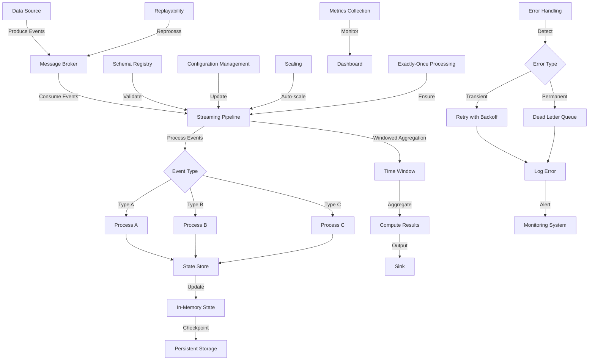

# Streaming

## Description
Streaming is a data extraction pattern that processes each record as it flows through the pipeline in real-time or near real-time. This pattern is essential for applications requiring low-latency data processing, such as real-time analytics, monitoring systems, and event-driven architectures. Streaming allows for continuous data ingestion and processing, enabling immediate insights and actions based on the most recent data.

## Constraints/Challenges
- Requires replayability to handle failures and ensure data consistency.
- Complex to manage due to issues like back pressure and rate limiting.
- Handling out-of-order events and late-arriving data.
- Ensuring exactly-once processing semantics.
- Dealing with state management in distributed streaming systems.
- Handling schema evolution in streaming data.
- Monitoring and debugging distributed streaming pipelines.

## Implementation Example
Here's a Python example using Apache Kafka and Faust for a streaming pattern:

```python
import faust

# Define the app
app = faust.App('streaming-example', broker='kafka://localhost:9092')

# Define the topic
topic = app.topic('input-topic', value_type=bytes)

# Define a table for storing aggregated results
table = app.Table('aggregated_results', default=int)

@app.agent(topic)
async def process(stream):
    async for event in stream:
        # Decode the event
        data = event.decode('utf-8')
        
        # Process the event (example: word count)
        words = data.split()
        for word in words:
            table[word] += 1
        
        # Yield the processed result
        yield f'Processed event: {data}'

@app.timer(interval=10.0)
async def print_results():
    for word, count in table.items():
        print(f'{word}: {count}')

if __name__ == '__main__':
    app.main()
```

## Mermaid Diagram


## Notes and References
- Streaming is crucial for low-latency applications and real-time data processing.
- Implement proper error handling and dead letter queues for messages that fail processing.
- Use a schema registry to manage and evolve data schemas in your streaming pipeline.
- Implement windowing strategies to handle out-of-order and late-arriving data.
- Consider using a state store for managing stateful operations in your streaming pipeline.
- Implement proper monitoring and alerting for your streaming pipeline to quickly identify and resolve issues.

### Best Practices
1. **Fault Tolerance**: Design your streaming system to be resilient to failures, including node failures and network partitions.
2. **Scalability**: Ensure your streaming pipeline can scale horizontally to handle increased load.
3. **Backpressure Handling**: Implement mechanisms to handle backpressure when consumers can't keep up with producers.
4. **Exactly-Once Processing**: Use techniques like idempotent producers and transactional processing to ensure exactly-once semantics.
5. **Data Quality**: Implement data quality checks and validation as part of your streaming pipeline.
6. **Monitoring and Observability**: Set up comprehensive monitoring and logging for your streaming pipeline to track performance and troubleshoot issues.

### Additional References:
- [Streaming Systems](https://www.oreilly.com/library/view/streaming-systems/9781491983867/) by Tyler Akidau, Slava Chernyak, and Reuven Lax
- [Kafka: The Definitive Guide](https://www.oreilly.com/library/view/kafka-the-definitive/9781491936153/) by Neha Narkhede, Gwen Shapira, and Todd Palino
- [Faust Documentation](https://faust.readthedocs.io/en/latest/)
- [Apache Kafka Documentation](https://kafka.apache.org/documentation/)
- [Confluent Schema Registry](https://docs.confluent.io/platform/current/schema-registry/index.html)
- [The Dataflow Model](https://research.google/pubs/pub43864/) by Tyler Akidau et al.
- [Spark Structured Streaming](https://spark.apache.org/docs/latest/structured-streaming-programming-guide.html)