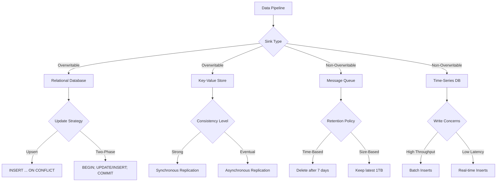

# Sink Overwritability

## Description
Sink overwritability refers to the ability of a data sink to update or replace existing data. Sinks can be categorised as overwritable or non-overwritable, each with its own use cases and challenges.

### Overwritable Sinks
Overwritable sinks allow existing data to be updated or replaced. Examples include:
- Relational databases with primary keys
- Key-value stores
- Cloud object storage with versioning

### Non-Overwritable Sinks
Non-overwritable sinks only allow new data to be appended. Examples include:
- Append-only log files
- Time-series databases
- Message queues without compaction

## Constraints/Challenges
- **Data Consistency**: Ensuring atomic updates in overwritable sinks to maintain data integrity.
- **Concurrency Control**: Managing multiple writers in overwritable sinks to prevent race conditions.
- **Data Retention**: Implementing efficient retention policies in non-overwritable sinks to manage storage growth.
- **Error Handling**: Developing robust recovery mechanisms for both sink types in case of failures.
- **Performance**: Balancing read/write performance, especially for overwritable sinks with frequent updates.
- **Data Loss Prevention**: Implementing safeguards against accidental overwrites or deletions.

## Implementation Examples

### Overwritable Sink: PostgreSQL Database
```sql
-- Create a table with a primary key
CREATE TABLE users (
    id SERIAL PRIMARY KEY,
    username VARCHAR(50) UNIQUE,
    email VARCHAR(100),
    last_login TIMESTAMP
);

-- Insert or update a user
INSERT INTO users (username, email, last_login)
VALUES ('john_doe', 'john@example.com', NOW())
ON CONFLICT (username)
DO UPDATE SET email = EXCLUDED.email, last_login = EXCLUDED.last_login;
```

### Non-Overwritable Sink: Apache Kafka Topic
```java
Properties props = new Properties();
props.put("bootstrap.servers", "localhost:9092");
props.put("key.serializer", "org.apache.kafka.common.serialization.StringSerializer");
props.put("value.serializer", "org.apache.kafka.common.serialization.StringSerializer");

Producer<String, String> producer = new KafkaProducer<>(props);
producer.send(new ProducerRecord<>("user_events", "user123", "login_event"));
producer.close();
```

## Mermaid Diagram


## Best Practices and Considerations
1. **Data Modeling**: Design your data model to accommodate the sink's overwritability characteristics.
2. **Idempotency**: Implement idempotent writes to handle potential duplicate data in both sink types.
3. **Versioning**: Use versioning or timestamps in overwritable sinks to track data changes over time.
4. **Backup and Recovery**: Implement regular backups and point-in-time recovery for both sink types.
5. **Monitoring**: Set up alerts for sink capacity, write errors, and performance degradation.
6. **Compliance**: Ensure your sink strategy complies with data retention and privacy regulations.

## Notes and References
- Overwritable sinks are ideal for maintaining the current state of data, such as user profiles or product inventories.
- Non-overwritable sinks excel in scenarios requiring complete audit trails or event sourcing patterns.
- Consider using a lambda architecture with both sink types for comprehensive data management.
- Implement proper monitoring and alerting for sink capacity, performance, and data integrity.

### Additional References:
- [Designing Data-Intensive Applications](https://dataintensive.net/) by Martin Kleppmann (Chapter 3: Storage and Retrieval)
- [Streaming Systems](https://www.oreilly.com/library/view/streaming-systems/9781491983867/) by Tyler Akidau, Slava Chernyak, and Reuven Lax
- [Data Management at Scale](https://www.oreilly.com/library/view/data-management-at/9781492054771/) by Piethein Strengholt
- [Kafka: The Definitive Guide](https://www.oreilly.com/library/view/kafka-the-definitive/9781491936153/) by Neha Narkhede, Gwen Shapira, and Todd Palino
- [Designing Event-Driven Systems](https://www.oreilly.com/library/view/designing-event-driven-systems/9781492038252/) by Ben Stopford
=======
# Sink Overwritability

## Description
Sink overwritability refers to the ability of a data sink to update or replace existing data. Sinks can be categorised as overwritable or non-overwritable, each with its own use cases and challenges.

### Overwritable Sinks
Overwritable sinks allow existing data to be updated or replaced. Examples include:
- Relational databases with primary keys
- Key-value stores
- Cloud object storage with versioning

### Non-Overwritable Sinks
Non-overwritable sinks only allow new data to be appended. Examples include:
- Append-only log files
- Time-series databases
- Message queues without compaction

## Constraints/Challenges
- **Data Consistency**: Ensuring atomic updates in overwritable sinks to maintain data integrity.
- **Concurrency Control**: Managing multiple writers in overwritable sinks to prevent race conditions.
- **Data Retention**: Implementing efficient retention policies in non-overwritable sinks to manage storage growth.
- **Error Handling**: Developing robust recovery mechanisms for both sink types in case of failures.
- **Performance**: Balancing read/write performance, especially for overwritable sinks with frequent updates.
- **Data Loss Prevention**: Implementing safeguards against accidental overwrites or deletions.

## Implementation Examples

### Overwritable Sink: PostgreSQL Database
```sql
-- Create a table with a primary key
CREATE TABLE users (
    id SERIAL PRIMARY KEY,
    username VARCHAR(50) UNIQUE,
    email VARCHAR(100),
    last_login TIMESTAMP
);

-- Insert or update a user
INSERT INTO users (username, email, last_login)
VALUES ('john_doe', 'john@example.com', NOW())
ON CONFLICT (username)
DO UPDATE SET email = EXCLUDED.email, last_login = EXCLUDED.last_login;
```

### Non-Overwritable Sink: Apache Kafka Topic
```java
Properties props = new Properties();
props.put("bootstrap.servers", "localhost:9092");
props.put("key.serializer", "org.apache.kafka.common.serialization.StringSerializer");
props.put("value.serializer", "org.apache.kafka.common.serialization.StringSerializer");

Producer<String, String> producer = new KafkaProducer<>(props);
producer.send(new ProducerRecord<>("user_events", "user123", "login_event"));
producer.close();
```

## Mermaid Diagram


## Best Practices and Considerations
1. **Data Modeling**: Design your data model to accommodate the sink's overwritability characteristics.
2. **Idempotency**: Implement idempotent writes to handle potential duplicate data in both sink types.
3. **Versioning**: Use versioning or timestamps in overwritable sinks to track data changes over time.
4. **Backup and Recovery**: Implement regular backups and point-in-time recovery for both sink types.
5. **Monitoring**: Set up alerts for sink capacity, write errors, and performance degradation.
6. **Compliance**: Ensure your sink strategy complies with data retention and privacy regulations.

## Notes and References
- Overwritable sinks are ideal for maintaining the current state of data, such as user profiles or product inventories.
- Non-overwritable sinks excel in scenarios requiring complete audit trails or event sourcing patterns.
- Consider using a lambda architecture with both sink types for comprehensive data management.
- Implement proper monitoring and alerting for sink capacity, performance, and data integrity.

### Additional References:
- [Designing Data-Intensive Applications](https://dataintensive.net/) by Martin Kleppmann (Chapter 3: Storage and Retrieval)
- [Streaming Systems](https://www.oreilly.com/library/view/streaming-systems/9781491983867/) by Tyler Akidau, Slava Chernyak, and Reuven Lax
- [Data Management at Scale](https://www.oreilly.com/library/view/data-management-at/9781492054771/) by Piethein Strengholt
- [Kafka: The Definitive Guide](https://www.oreilly.com/library/view/kafka-the-definitive/9781491936153/) by Neha Narkhede, Gwen Shapira, and Todd Palino
- [Designing Event-Driven Systems](https://www.oreilly.com/library/view/designing-event-driven-systems/9781492038252/) by Ben Stopford
