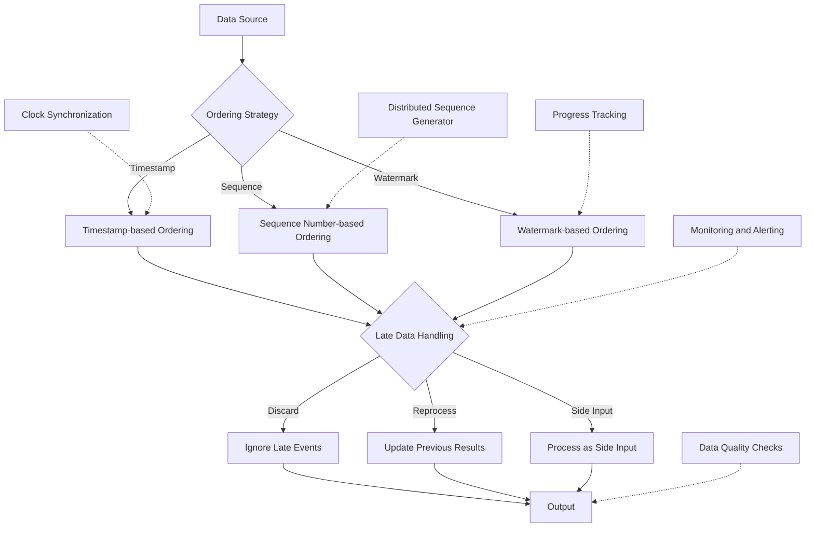

# Source Ordering

## Description
Source ordering is a critical aspect of data pipelines that ensures events are processed in the correct sequence. This is particularly important for maintaining data integrity and deriving accurate insights from event-driven systems.

## Types of Ordering
1. **Total Order**: All events are strictly ordered across the entire dataset.
2. **Partial Order**: Events are ordered within specific partitions or groups.
3. **Causal Order**: Events are ordered based on their causal relationships.

## Constraints/Challenges
- **Out-of-Order Events**: Handling events that arrive later than their logical occurrence time.
- **Data Integrity**: Ensuring consistent state transitions and accurate aggregations.
- **Clock Skew**: Dealing with time discrepancies in distributed systems.
- **Late Data**: Managing data that arrives after its expected processing window.
- **Scalability**: Maintaining order while processing high-volume, high-velocity data streams.
- **Exactly-Once Processing**: Guaranteeing that each event is processed once and only once in the correct order.

## Implementation Strategies

### 1. Timestamp-based Ordering
Use event timestamps to order data:

```python
from datetime import datetime
from operator import attrgetter

class Event:
    def __init__(self, timestamp, data):
        self.timestamp = timestamp
        self.data = data

events = [
    Event(datetime(2023, 5, 1, 10, 0), "Login"),
    Event(datetime(2023, 5, 1, 10, 5), "Purchase"),
    Event(datetime(2023, 5, 1, 9, 55), "Browse"),  # Out of order
]

sorted_events = sorted(events, key=attrgetter('timestamp'))
for event in sorted_events:
    print(f"{event.timestamp}: {event.data}")
```

### 2. Sequence Number-based Ordering
Assign sequence numbers to events:

```python
class SequencedEvent:
    def __init__(self, sequence, data):
        self.sequence = sequence
        self.data = data

events = [
    SequencedEvent(1, "Start"),
    SequencedEvent(3, "Process"),  # Out of order
    SequencedEvent(2, "Validate"),
]

sorted_events = sorted(events, key=attrgetter('sequence'))
for event in sorted_events:
    print(f"Sequence {event.sequence}: {event.data}")
```

### 3. Watermarking
Use watermarks to handle late-arriving data:

```python
from apache_beam import WindowInto, window

# Assuming we're using Apache Beam
with beam.Pipeline() as p:
    events = (p | ReadFromKafka()
                | WindowInto(window.FixedWindows(60),  # 60-second windows
                             trigger=AfterWatermark(late=AfterCount(1)),
                             allowed_lateness=Duration(seconds=300))
                | ProcessEvents())
```

## Mermaid Diagram


## Best Practices and Considerations
1. **Use Event Time**: Prefer event time over processing time for accurate ordering.
2. **Implement Windowing**: Use time-based or count-based windows to group and process events.
3. **Handle Late Data**: Implement strategies to deal with late-arriving data, such as watermarking or side inputs.
4. **Ensure Idempotency**: Design processing logic to be idempotent to handle potential reprocessing.
5. **Monitor Lag**: Set up monitoring for processing lag and out-of-order events.
6. **Consider Partitioning**: Use partitioning to maintain partial order when total order is not required.
7. **Implement Backpressure**: Use backpressure mechanisms to handle spikes in data volume.

## Notes and References
- Event time and processing time discrepancies can lead to complex ordering challenges.
- Consider using specialized stream processing frameworks like Apache Flink or Apache Beam for advanced ordering capabilities.
- Implement proper monitoring and alerting for out-of-order events and processing delays.
- Understand the trade-offs between strict ordering and system performance/scalability.

### Additional References:
- [Streaming Systems](https://www.oreilly.com/library/view/streaming-systems/9781491983867/) by Tyler Akidau, Slava Chernyak, and Reuven Lax (Chapter 2: The What, Where, When, and How of Data Processing)
- [Designing Data-Intensive Applications](https://dataintensive.net/) by Martin Kleppmann (Chapter 11: Stream Processing)
- [The Dataflow Model](https://research.google/pubs/pub43864/) by Tyler Akidau et al.
- [Apache Flink: Stream and Batch Processing in a Single Engine](https://flink.apache.org/flink-architecture.html)
- [Kafka Streams Documentation](https://kafka.apache.org/documentation/streams/)
- [Google Cloud Dataflow: Processing Data in Time Windows](https://cloud.google.com/dataflow/docs/concepts/windowing)
=======
# Source Ordering

## Description
Source ordering is a critical aspect of data pipelines that ensures events are processed in the correct sequence. This is particularly important for maintaining data integrity and deriving accurate insights from event-driven systems.

## Types of Ordering
1. **Total Order**: All events are strictly ordered across the entire dataset.
2. **Partial Order**: Events are ordered within specific partitions or groups.
3. **Causal Order**: Events are ordered based on their causal relationships.

## Constraints/Challenges
- **Out-of-Order Events**: Handling events that arrive later than their logical occurrence time.
- **Data Integrity**: Ensuring consistent state transitions and accurate aggregations.
- **Clock Skew**: Dealing with time discrepancies in distributed systems.
- **Late Data**: Managing data that arrives after its expected processing window.
- **Scalability**: Maintaining order while processing high-volume, high-velocity data streams.
- **Exactly-Once Processing**: Guaranteeing that each event is processed once and only once in the correct order.

## Implementation Strategies

### 1. Timestamp-based Ordering
Use event timestamps to order data:

```python
from datetime import datetime
from operator import attrgetter

class Event:
    def __init__(self, timestamp, data):
        self.timestamp = timestamp
        self.data = data

events = [
    Event(datetime(2023, 5, 1, 10, 0), "Login"),
    Event(datetime(2023, 5, 1, 10, 5), "Purchase"),
    Event(datetime(2023, 5, 1, 9, 55), "Browse"),  # Out of order
]

sorted_events = sorted(events, key=attrgetter('timestamp'))
for event in sorted_events:
    print(f"{event.timestamp}: {event.data}")
```

### 2. Sequence Number-based Ordering
Assign sequence numbers to events:

```python
class SequencedEvent:
    def __init__(self, sequence, data):
        self.sequence = sequence
        self.data = data

events = [
    SequencedEvent(1, "Start"),
    SequencedEvent(3, "Process"),  # Out of order
    SequencedEvent(2, "Validate"),
]

sorted_events = sorted(events, key=attrgetter('sequence'))
for event in sorted_events:
    print(f"Sequence {event.sequence}: {event.data}")
```

### 3. Watermarking
Use watermarks to handle late-arriving data:

```python
from apache_beam import WindowInto, window

# Assuming we're using Apache Beam
with beam.Pipeline() as p:
    events = (p | ReadFromKafka()
                | WindowInto(window.FixedWindows(60),  # 60-second windows
                             trigger=AfterWatermark(late=AfterCount(1)),
                             allowed_lateness=Duration(seconds=300))
                | ProcessEvents())
```

## Mermaid Diagram


## Best Practices and Considerations
1. **Use Event Time**: Prefer event time over processing time for accurate ordering.
2. **Implement Windowing**: Use time-based or count-based windows to group and process events.
3. **Handle Late Data**: Implement strategies to deal with late-arriving data, such as watermarking or side inputs.
4. **Ensure Idempotency**: Design processing logic to be idempotent to handle potential reprocessing.
5. **Monitor Lag**: Set up monitoring for processing lag and out-of-order events.
6. **Consider Partitioning**: Use partitioning to maintain partial order when total order is not required.
7. **Implement Backpressure**: Use backpressure mechanisms to handle spikes in data volume.

## Notes and References
- Event time and processing time discrepancies can lead to complex ordering challenges.
- Consider using specialized stream processing frameworks like Apache Flink or Apache Beam for advanced ordering capabilities.
- Implement proper monitoring and alerting for out-of-order events and processing delays.
- Understand the trade-offs between strict ordering and system performance/scalability.

### Additional References:
- [Streaming Systems](https://www.oreilly.com/library/view/streaming-systems/9781491983867/) by Tyler Akidau, Slava Chernyak, and Reuven Lax (Chapter 2: The What, Where, When, and How of Data Processing)
- [Designing Data-Intensive Applications](https://dataintensive.net/) by Martin Kleppmann (Chapter 11: Stream Processing)
- [The Dataflow Model](https://research.google/pubs/pub43864/) by Tyler Akidau et al.
- [Apache Flink: Stream and Batch Processing in a Single Engine](https://flink.apache.org/flink-architecture.html)
- [Kafka Streams Documentation](https://kafka.apache.org/documentation/streams/)
- [Google Cloud Dataflow: Processing Data in Time Windows](https://cloud.google.com/dataflow/docs/concepts/windowing)
