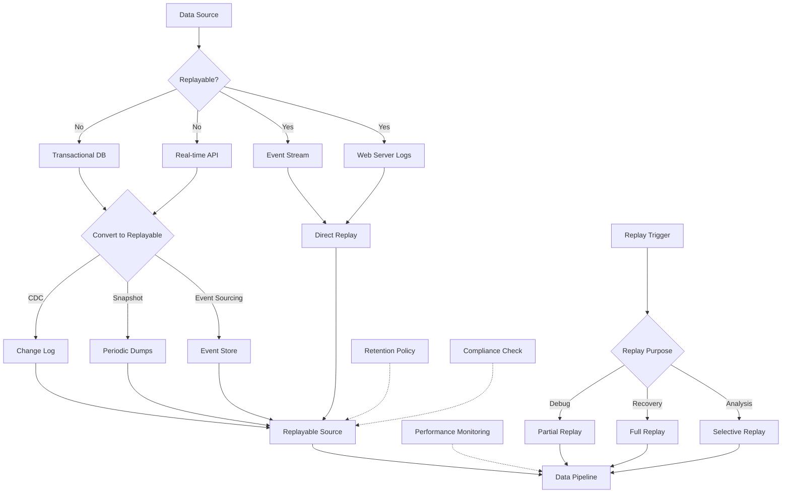

# Source Replayability

## Description
Source replayability refers to the ability to reprocess data from its origin multiple times. This capability is crucial for debugging, data recovery, and maintaining data lineage. Sources can be categorised as inherently replayable or non-replayable, with strategies to convert non-replayable sources into replayable ones.

### Replayable Sources
- Event streams (e.g., Apache Kafka topics)
- Web server logs
- Version-controlled databases (e.g., Datomic)
- Append-only logs

### Non-Replayable Sources
- Transactional databases without change data capture
- Real-time APIs
- Volatile memory stores

## Constraints/Challenges
- **Data Consistency**: Ensuring consistency when converting non-replayable to replayable sources.
- **Volume Management**: Efficiently handling and storing large volumes of data for replay.
- **Cost Optimisation**: Balancing storage costs with replayability requirements.
- **Versioning**: Implementing proper versioning for accurate replay of historical data.
- **Performance**: Managing system performance during data replay.
- **Compliance**: Adhering to data retention and privacy regulations.

## Implementation Strategies

### 1. Change Data Capture (CDC) for Databases
Implement CDC to capture changes in non-replayable database sources:

```sql
-- Enable CDC for a specific table in SQL Server
EXEC sys.sp_cdc_enable_table
    @source_schema = N'dbo',
    @source_name   = N'employees',
    @role_name     = NULL,
    @supports_net_changes = 1
GO
```

### 2. Periodic Snapshots for APIs
Create periodic snapshots of API data:

```python
import requests
import json
from datetime import datetime

def snapshot_api_data(api_url, output_file):
    response = requests.get(api_url)
    data = response.json()
    
    timestamp = datetime.now().isoformat()
    snapshot = {
        "timestamp": timestamp,
        "data": data
    }
    
    with open(output_file, 'a') as f:
        json.dump(snapshot, f)
        f.write('\n')

# Run this function periodically
snapshot_api_data("https://api.example.com/data", "api_snapshots.jsonl")
```

### 3. Event Sourcing Pattern
Implement event sourcing to make application state replayable:

```python
class BankAccount:
    def __init__(self):
        self.balance = 0
        self.events = []

    def apply_event(self, event):
        if event['type'] == 'DEPOSIT':
            self.balance += event['amount']
        elif event['type'] == 'WITHDRAW':
            self.balance -= event['amount']
        self.events.append(event)

    def deposit(self, amount):
        event = {'type': 'DEPOSIT', 'amount': amount}
        self.apply_event(event)

    def withdraw(self, amount):
        event = {'type': 'WITHDRAW', 'amount': amount}
        self.apply_event(event)

    def replay_events(self):
        self.balance = 0
        for event in self.events:
            self.apply_event(event)

# Usage
account = BankAccount()
account.deposit(100)
account.withdraw(30)
print(f"Balance: {account.balance}")  # Output: 70

# Replay events
account.replay_events()
print(f"Replayed Balance: {account.balance}")  # Output: 70
```

## Mermaid Diagram


## Best Practices and Considerations
1. **Immutability**: Design replayable sources to be immutable to ensure consistent replays.
2. **Scalability**: Implement distributed storage solutions for large-scale replayable sources.
3. **Compression**: Use efficient compression techniques to reduce storage costs.
4. **Metadata**: Include rich metadata with each event for better context during replay.
5. **Partitioning**: Partition data for efficient partial replays and parallel processing.
6. **Auditing**: Implement auditing mechanisms to track data access and replays.
7. **Data Governance**: Establish clear policies for data retention and access control.

## Notes and References
- Replayable sources are fundamental for implementing event-driven architectures and CQRS patterns.
- Consider using specialised event store databases for complex event sourcing scenarios.
- Implement proper monitoring and alerting for storage usage and replay performance.
- Regularly test the replay functionality to ensure system resilience.

### Additional References:
- [Designing Data-Intensive Applications](https://dataintensive.net/) by Martin Kleppmann (Chapter 11: Stream Processing)
- [The Data Warehouse Toolkit](https://www.kimballgroup.com/data-warehouse-business-intelligence-resources/books/data-warehouse-dw-toolkit/) by Ralph Kimball and Margy Ross
- [Change Data Capture in Data Warehousing](https://www.talend.com/resources/change-data-capture/)
- [Apache Kafka: The Definitive Guide](https://www.confluent.io/resources/kafka-the-definitive-guide/) by Neha Narkhede, Gwen Shapira, and Todd Palino
- [Event Sourcing Pattern](https://docs.microsoft.com/en-us/azure/architecture/patterns/event-sourcing)
- [Building Event-Driven Microservices](https://www.oreilly.com/library/view/building-event-driven-microservices/9781492057888/) by Adam Bellemare
- [Streaming Systems](https://www.oreilly.com/library/view/streaming-systems/9781491983867/) by Tyler Akidau, Slava Chernyak, and Reuven Lax