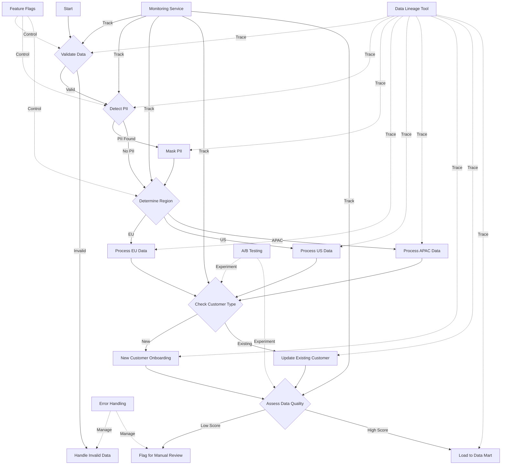

# Conditional/Dynamic Pipelines

## Description
Conditional or dynamic pipelines are data workflows that adapt based on runtime conditions or inputs. They handle complex flows and provide central control over data processing paths. This pattern is particularly useful when dealing with diverse data sources, varying data quality, or when business logic requires different processing based on data characteristics.

## Constraints/Challenges
- Increased complexity in pipeline design and maintenance.
- Hard to debug due to multiple possible execution paths.
- Complex to test comprehensively, requiring extensive scenario coverage.
- Ensuring all possible paths are covered and properly handled.
- Managing increased complexity in pipeline orchestration and scheduling.
- Potential for increased runtime if condition evaluation is computationally expensive.
- Difficulty in predicting resource usage and optimising performance.

## Detailed Example
Let's consider a conditional pipeline for processing customer data in a multi-national company:

1. Data Ingestion:
   - Ingest customer data from various regional systems.

2. Data Validation:
   - Check data completeness and format.
   - If data is incomplete, route to an error handling process.

3. PII Detection:
   - Scan for Personally Identifiable Information (PII).
   - If PII is detected, apply appropriate masking or encryption.

4. Regional Processing:
   - Based on the customer's region, apply specific transformations:
     - For EU customers, ensure GDPR compliance.
     - For US customers, apply state-specific regulations.
     - For APAC customers, handle multiple languages and address formats.

5. Customer Segmentation:
   - If the customer is new, route to a new customer onboarding process.
   - If it's an existing customer, update their record and check for upsell opportunities.

6. Data Quality Scoring:
   - Assign a quality score based on completeness and consistency.
   - If the score is below a threshold, flag for manual review.

7. Data Mart Loading:
   - Based on the data quality score and customer segment, load into appropriate data marts.

## Implementation Example (Python with Apache Airflow)

```python
from airflow import DAG
from airflow.operators.python_operator import PythonOperator, BranchPythonOperator
from airflow.operators.dummy_operator import DummyOperator
from datetime import datetime, timedelta

default_args = {
    'owner': 'data_engineer',
    'depends_on_past': False,
    'start_date': datetime(2023, 8, 1),
    'email_on_failure': False,
    'email_on_retry': False,
    'retries': 1,
    'retry_delay': timedelta(minutes=5),
}

dag = DAG(
    'conditional_customer_pipeline',
    default_args=default_args,
    description='A conditional pipeline for processing customer data',
    schedule_interval=timedelta(days=1),
)

def validate_data(**kwargs):
    # Simulate data validation
    data_valid = True
    if data_valid:
        return 'pii_detection'
    else:
        return 'handle_invalid_data'

def detect_pii(**kwargs):
    # Simulate PII detection
    pii_detected = True
    if pii_detected:
        return 'mask_pii'
    else:
        return 'determine_region'

def determine_region(**kwargs):
    # Simulate region determination
    region = 'EU'
    if region == 'EU':
        return 'process_eu_data'
    elif region == 'US':
        return 'process_us_data'
    else:
        return 'process_apac_data'

def check_customer_type(**kwargs):
    # Simulate customer type check
    is_new_customer = False
    if is_new_customer:
        return 'new_customer_onboarding'
    else:
        return 'update_existing_customer'

def assess_data_quality(**kwargs):
    # Simulate data quality assessment
    quality_score = 85
    if quality_score < 70:
        return 'flag_for_manual_review'
    else:
        return 'load_to_data_mart'

# Define tasks
validate_data_task = BranchPythonOperator(
    task_id='validate_data',
    python_callable=validate_data,
    dag=dag,
)

pii_detection_task = BranchPythonOperator(
    task_id='pii_detection',
    python_callable=detect_pii,
    dag=dag,
)

determine_region_task = BranchPythonOperator(
    task_id='determine_region',
    python_callable=determine_region,
    dag=dag,
)

check_customer_type_task = BranchPythonOperator(
    task_id='check_customer_type',
    python_callable=check_customer_type,
    dag=dag,
)

assess_data_quality_task = BranchPythonOperator(
    task_id='assess_data_quality',
    python_callable=assess_data_quality,
    dag=dag,
)

# Define dummy operators for simplicity
handle_invalid_data = DummyOperator(task_id='handle_invalid_data', dag=dag)
mask_pii = DummyOperator(task_id='mask_pii', dag=dag)
process_eu_data = DummyOperator(task_id='process_eu_data', dag=dag)
process_us_data = DummyOperator(task_id='process_us_data', dag=dag)
process_apac_data = DummyOperator(task_id='process_apac_data', dag=dag)
new_customer_onboarding = DummyOperator(task_id='new_customer_onboarding', dag=dag)
update_existing_customer = DummyOperator(task_id='update_existing_customer', dag=dag)
flag_for_manual_review = DummyOperator(task_id='flag_for_manual_review', dag=dag)
load_to_data_mart = DummyOperator(task_id='load_to_data_mart', dag=dag)

# Define task dependencies
validate_data_task >> [pii_detection_task, handle_invalid_data]
pii_detection_task >> [mask_pii, determine_region_task]
mask_pii >> determine_region_task
determine_region_task >> [process_eu_data, process_us_data, process_apac_data]
[process_eu_data, process_us_data, process_apac_data] >> check_customer_type_task
check_customer_type_task >> [new_customer_onboarding, update_existing_customer]
[new_customer_onboarding, update_existing_customer] >> assess_data_quality_task
assess_data_quality_task >> [flag_for_manual_review, load_to_data_mart]
```

## Enhanced Mermaid Diagram


## Notes and References
- Conditional pipelines offer flexibility for various scenarios and can adapt to changing business requirements.
- Implement comprehensive logging and monitoring for all conditional paths to ensure visibility into pipeline execution.
- Use feature flags or configuration management for easier control of conditional logic, allowing for quick adjustments without code changes.
- Consider implementing A/B testing capabilities within the pipeline to compare different processing strategies.
- Ensure proper error handling and fallback mechanisms for each conditional branch.
- Regularly review and optimise decision points to prevent pipeline complexity from growing unmanageable.
- Use workflow visualisation tools to help team members understand the pipeline structure.

### Additional References:
- [Airflow: Dynamic DAGs](https://airflow.apache.org/docs/apache-airflow/stable/concepts/dynamic-dag-generation.html)
- [Feature Toggles (aka Feature Flags)](https://martinfowler.com/articles/feature-toggles.html) by Martin Fowler
- [Building Data Pipelines with Python](https://www.oreilly.com/library/view/building-data-pipelines/9781492091059/) by Yaser Mirzaei
- [Designing Data-Intensive Applications](https://dataintensive.net/) by Martin Kleppmann (Chapter 10: Batch Processing)
- [The Art of Monitoring](https://artofmonitoring.com/) by James Turnbull
- [Chaos Engineering: System Resiliency in Practice](https://www.oreilly.com/library/view/chaos-engineering/9781492043850/) by Casey Rosenthal and Nora Jones