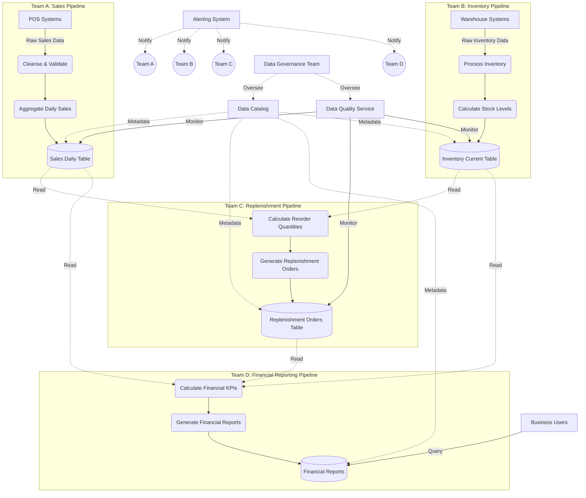

# Disconnected Pipelines

## Description
Disconnected pipelines are data workflows that are dependent on the outputs (sinks) of other pipelines without explicitly recognising or managing these cross-pipeline dependencies. This pattern allows for independent development and operation by multiple teams, promoting autonomy and reducing coordination overhead. However, it also introduces challenges in maintaining overall data consistency and traceability.

## Constraints/Challenges
- Difficult to debug end-to-end data flows due to lack of explicit connections.
- Challenging to define and monitor Service Level Agreements (SLAs) across the entire data lifecycle.
- Potential for data inconsistencies across pipelines due to uncoordinated changes.
- Difficulty in managing global data lineage and impact analysis.
- Risk of creating data silos and redundant processing.
- Complexity in managing data contracts between teams.
- Potential for increased data latency due to unoptimised handoffs between pipelines.

## Detailed Example
Let's consider a disconnected pipeline setup for a retail company:

1. Sales Pipeline (Team A):
   - Ingests raw sales data from point-of-sale systems.
   - Cleanses and validates the data.
   - Aggregates daily sales by store and product.
   - Outputs to a 'sales_daily' table.

2. Inventory Pipeline (Team B):
   - Pulls inventory data from warehouse management systems.
   - Processes returns and adjustments.
   - Calculates current stock levels.
   - Outputs to an 'inventory_current' table.

3. Replenishment Pipeline (Team C):
   - Reads from both 'sales_daily' and 'inventory_current' tables.
   - Calculates reorder quantities based on sales trends and current stock.
   - Generates replenishment orders.
   - Outputs to a 'replenishment_orders' table.

4. Financial Reporting Pipeline (Team D):
   - Combines data from 'sales_daily', 'inventory_current', and 'replenishment_orders'.
   - Calculates profit margins, turnover rates, and other KPIs.
   - Generates financial reports for management.

## Implementation Example (Python with Apache Beam)

```python
import apache_beam as beam
from apache_beam.options.pipeline_options import PipelineOptions

# Sales Pipeline (Team A)
def sales_pipeline():
    with beam.Pipeline(options=PipelineOptions()) as p:
        (p
         | 'Read POS Data' >> beam.io.ReadFromSource(pos_source)
         | 'Cleanse Sales' >> beam.Map(cleanse_sales_data)
         | 'Aggregate Daily Sales' >> beam.CombinePerKey(sum)
         | 'Write Sales Daily' >> beam.io.WriteToSink(sales_daily_sink)
        )

# Inventory Pipeline (Team B)
def inventory_pipeline():
    with beam.Pipeline(options=PipelineOptions()) as p:
        (p
         | 'Read Warehouse Data' >> beam.io.ReadFromSource(warehouse_source)
         | 'Process Inventory' >> beam.Map(process_inventory)
         | 'Calculate Stock Levels' >> beam.CombinePerKey(sum)
         | 'Write Inventory Current' >> beam.io.WriteToSink(inventory_current_sink)
        )

# Replenishment Pipeline (Team C)
def replenishment_pipeline():
    with beam.Pipeline(options=PipelineOptions()) as p:
        sales = p | 'Read Sales' >> beam.io.ReadFromSource(sales_daily_source)
        inventory = p | 'Read Inventory' >> beam.io.ReadFromSource(inventory_current_source)
        
        (({'sales': sales, 'inventory': inventory})
         | 'Calculate Reorder' >> beam.Map(calculate_reorder)
         | 'Generate Orders' >> beam.Map(generate_replenishment_order)
         | 'Write Replenishment Orders' >> beam.io.WriteToSink(replenishment_orders_sink)
        )

# Financial Reporting Pipeline (Team D)
def financial_reporting_pipeline():
    with beam.Pipeline(options=PipelineOptions()) as p:
        sales = p | 'Read Sales' >> beam.io.ReadFromSource(sales_daily_source)
        inventory = p | 'Read Inventory' >> beam.io.ReadFromSource(inventory_current_source)
        orders = p | 'Read Orders' >> beam.io.ReadFromSource(replenishment_orders_source)
        
        (({'sales': sales, 'inventory': inventory, 'orders': orders})
         | 'Calculate KPIs' >> beam.Map(calculate_financial_kpis)
         | 'Generate Reports' >> beam.Map(generate_financial_report)
         | 'Write Financial Reports' >> beam.io.WriteToSink(financial_reports_sink)
        )

if __name__ == '__main__':
    sales_pipeline()
    inventory_pipeline()
    replenishment_pipeline()
    financial_reporting_pipeline()
```

## Enhanced Mermaid Diagram


## Notes and References
- Disconnected pipelines are quick to build and allow for team autonomy, but can lead to challenges in maintaining overall data consistency.
- Implement a centralised metadata repository (data catalog) to track pipeline dependencies and data lineage across disconnected pipelines.
- Use data contracts to ensure consistency between disconnected pipelines, defining clear interfaces for data exchange.
- Consider implementing a data mesh architecture for better scalability and domain-oriented decentralised data ownership.
- Establish clear communication channels between teams to discuss changes that might impact downstream pipelines.
- Implement comprehensive monitoring and alerting to quickly identify issues that may arise from changes in upstream pipelines.
- Regularly conduct data quality assessments across pipeline boundaries to ensure consistency.

### Additional References:
- [Building Microservices](https://samnewman.io/books/building_microservices_2nd_edition/) by Sam Newman
- [Designing Data-Intensive Applications](https://dataintensive.net/) by Martin Kleppmann (Chapter 12: The Future of Data Systems)
- [The Data Catalog: Sherlock Holmes' Cornerstone for Modern Analytics](https://towardsdatascience.com/the-data-catalog-sherlock-holmes-cornerstone-for-modern-analytics-9cbab47373cc)
- [Data Contracts: What Are They and Why Are They Important?](https://towardsdatascience.com/data-contracts-what-are-they-and-why-are-they-important-89aeba4d5cd3) by Andrew Jones
- [Apache Beam Programming Guide](https://beam.apache.org/documentation/programming-guide/)
- [Governance in the Age of Data Mesh](https://martinfowler.com/articles/data-mesh-governance.html) by Zhamak Dehghani
- [The Rise of the Data Product Manager](https://medium.com/geekculture/the-rise-of-the-data-product-manager-8af8d8a64ea0) by Tristan Handy