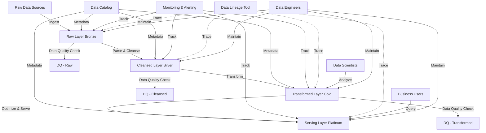

# Multi-hop Pipelines

## Description
Multi-hop pipelines involve keeping data separated at different levels of "cleanliness" through multiple transformation layers, which makes debugging easier and enhances data quality management. This pattern is particularly useful in large-scale data warehousing and analytics projects where data goes through several stages of refinement before reaching its final consumable form.

## Constraints/Challenges
- Steep learning curve for new team members to understand the entire pipeline.
- Higher storage and processing costs due to maintaining multiple versions of the data.
- Maintaining consistency across multiple layers, especially when schema changes occur.
- Managing dependencies between layers and ensuring proper data lineage.
- Increased complexity in pipeline orchestration and scheduling.
- Potential for increased latency in data availability for end-users.

## Detailed Example
Let's consider a multi-hop pipeline for an e-commerce platform:

1. Raw Layer (Bronze):
   - Ingest raw data from various sources (e.g., web logs, transaction systems, inventory management).
   - Store data in its original format with minimal transformations.
   - Example: Store JSON logs from web servers, CSV files from inventory systems.

2. Cleansed Layer (Silver):
   - Parse and validate data from the raw layer.
   - Apply data type conversions and basic data quality rules.
   - Standardise formats (e.g., dates, currencies).
   - Example: Convert timestamps to a standard format, validate product IDs.

3. Transformed Layer (Gold):
   - Apply business logic and complex transformations.
   - Join data from multiple sources.
   - Create aggregations and derived fields.
   - Example: Calculate daily sales by product category, join customer data with transactions.

4. Serving Layer (Platinum):
   - Create specialised data marts for different use cases.
   - Optimise data for query performance (e.g., pre-aggregations, materialised views).
   - Apply access controls and data masking for sensitive information.
   - Example: Create a customer 360 view, generate a daily sales dashboard.

## Implementation Example (Python with PySpark)

```python
from pyspark.sql import SparkSession
from pyspark.sql.functions import from_json, col, to_date

# Initialise Spark session
spark = SparkSession.builder.appName("Multi-hop Pipeline").getOrCreate()

# 1. Raw Layer (Bronze)
def ingest_raw_data(date):
    return spark.read.json(f"s3://raw-bucket/weblogs/{date}")

# 2. Cleansed Layer (Silver)
def cleanse_data(raw_df):
    return raw_df.select(
        from_json(col("data"), web_log_schema).alias("parsed_data")
    ).select(
        "parsed_data.user_id",
        to_date("parsed_data.timestamp").alias("date"),
        "parsed_data.page_url",
        "parsed_data.product_id"
    )

# 3. Transformed Layer (Gold)
def transform_data(cleansed_df):
    return cleansed_df.groupBy("date", "product_id").count().alias("page_views")

# 4. Serving Layer (Platinum)
def create_data_mart(transformed_df):
    return transformed_df.join(
        spark.table("dim_products"),
        on="product_id"
    ).groupBy("date", "product_category").sum("page_views")

# Main pipeline
def run_pipeline(date):
    raw_data = ingest_raw_data(date)
    cleansed_data = cleanse_data(raw_data)
    transformed_data = transform_data(cleansed_data)
    final_mart = create_data_mart(transformed_data)
    
    final_mart.write.mode("overwrite").saveAsTable("product_category_daily_views")

# Run the pipeline
run_pipeline("2023-08-27")
```

## Enhanced Mermaid Diagram


## Notes and References
- Multi-hop pipelines allow for detailed data lineage and easier error isolation, making it simpler to track down issues in complex data flows.
- Implement proper monitoring and alerting at each stage to quickly identify and resolve issues.
- Use data quality checks between hops to ensure data integrity and prevent propagation of errors.
- Consider implementing a metadata management system for better visibility into data transformations and lineage.
- Optimize storage and compute resources by implementing appropriate data retention policies at each layer.
- Use appropriate technologies for each layer, e.g., object storage for raw data, columnar formats for analytical layers.

### Additional References:
- [The Data Warehouse Toolkit](https://www.kimballgroup.com/data-warehouse-business-intelligence-resources/books/data-warehouse-dw-toolkit/) by Ralph Kimball and Margy Ross
- [Building a Scalable Data Warehouse with Data Vault 2.0](https://www.amazon.com/Building-Scalable-Data-Warehouse-Vault/dp/0128025107) by Dan Linstedt and Michael Olschimke
- [Fundamentals of Data Engineering](https://www.oreilly.com/library/view/fundamentals-of-data/9781098108298/) by Joe Reis and Matt Housley
- [Databricks: Delta Lake Architecture](https://docs.databricks.com/delta/delta-intro.html)
- [Data Mesh Principles and Logical Architecture](https://martinfowler.com/articles/data-mesh-principles.html) by Zhamak Dehghani